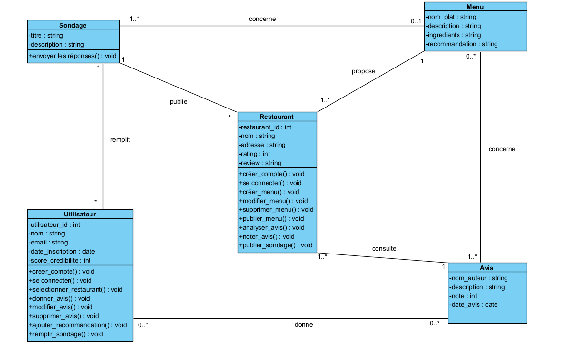

# Conception

## Architecture

Le système utilisera une architecture MVC (Modèle - Vue - Contrôleur) pour séparer clairement les responsabilités, améliorer la maintenabilité du code et faciliter le développement collaboratif.

- Modèle:  encapsule l’état de l’application et répond aux demandes d’état en exposant les fonctions de l’application. 
Dans notre projet, cela correspond aux schémas Mongoose (utilisateurs, restaurants, menus, messages, feedbacks) que l'on stockera dans MongoDB.
- vue: fait le rendu du modèle et envoie des actions de l’utilisateur au contrôleur. C’est l’interface utilisateur, construite avec React.js.
Elle affichera les informations reçues du contrôleur (ex. : listes de menus, messages, formulaires).
- Contrôleur:  définit le comportement de l’application. Il traite les actions de l’utilisateur et met à jour le modèle. Elle Fait le lien entre les données (Modèle) et l’interface (Vue). Elle va Geré les routes API via Express.js. Il traitera les requêtes des utilisateurs et renvoie les bonnes réponses.

## Choix technologiques

- Frontend	React.js : Idéale pour construire des interfaces utilisateurs dynamiques et interactives. Elle facilite la gestion des routes et des états. L'Interactivité est fluide, permet un chargement rapide des pages, possede egalement une documentation pour nous guider dans la realisation de nos projets
- Backend	Node.js + Express: Node.js permet d’exécuter du JavaScript côté serveur, ce qui unifie le langage entre le frontend et le backend. Couplé à Express, il permet de construire rapidement des API REST robustes et évolutives. Les deux permettent une rapidite de developpement
- Base de données	MongoDB: Notre choix se porte sur MongoDB parceque c'est une base de données NoSQL orientée documents, parfaitement adaptée aux structures souples comme les retours clients, les tags, ou les propositions de menus, dont la structure peut varier d’un restaurant à un autre. Et de plus, elle s’intègre facilement avec Node.js via Mongoose.
- Authentification	JWT : JWT (JSON Web Tokens) permet une authentification sécurisée, simple à implémenter, et adaptée aux API REST.
- API externe : Google Places API permet d'enrichir les profils des restaurants avec des informations vérifiées, telles que la localisation, les horaires, les avis Google, et d'autres détails utiles.
- Prototype: outil de conception d’interface collaboratif qui permet de créer des maquettes interactives et de simuler la navigation entre les pages. Nous l'avons utilisé pour concevoir le prototype visuel de la plateforme, définir l’architecture des pages, organiser les éléments (boutons, formulaires, sections), et tester l’expérience utilisateur avant le développement.

## Diagrammes utilisés

- Diagramme de classe: Le diagramme de classes représente la structure statique de l'application en modélisant les principales entités du système, leurs attributs, ainsi que les relations entre elles. Il permet de mieux comprendre l’organisation des données, les responsabilités de chaque classe, et les interactions possibles dans l’application.

Schéma diagramme de classe: 

## Prototype

- lien du prototype vers figma: 

https://www.figma.com/proto/FUPyLLIEeKhFIXdpyJFAXw/prototype-TestMyMenu?node-id=2003-121&p=f&t=eFulUY7hQle9damV-1&scaling=scale-down&content-scaling=fixed&page-id=0%3A1&starting-point-node-id=2003%3A121 

